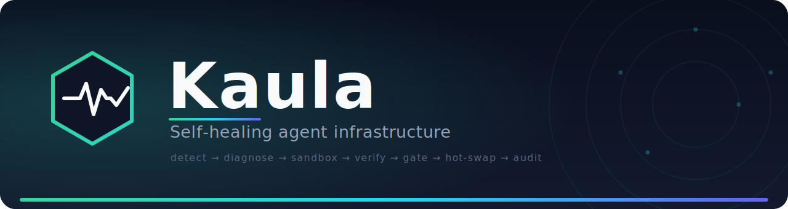

<p align="center">
  
</p>

<p align="center">
  <b>Self-healing infrastructure for AI agents.</b><br>
  Broken tools get rewritten, sandbox-verified, hot-swapped live — audited, and reversible in one step.
</p>

<p align="center">
  <a href="LICENSE"></a>
  
  
  
  <a href="docs/user-guide.md"></a>
</p>

---

Kaula is self-healing agent infrastructure, built on CrewAI. When an agent's
tool fails at runtime, Kaula captures the failure, has a repair agent rewrite
the tool, verifies the candidate in a sandbox (tests + security scan), and
hot-swaps it live — **only if it passes**. Every change is written to an
immutable, hash-chained audit trail and is reversible in one step.

Guiding principle: **easy to change, impossible to change invisibly.**

## Packages (v0)

Monorepo of independently published distributions sharing the `kaula.*`
namespace (PEP 420). Open tier, Apache-2.0:

| Distribution | Import | What it is |
|---|---|---|
| `kaula-core` | `kaula.core` | Domain types, seam Protocols, the loop state machine. Framework-agnostic. |
| `kaula-self-healing` | `kaula.self_healing` | The reference self-healing loop + static scanner. |
| `kaula-runtime` | `kaula.runtime` | CrewAI adapter: tool interception, healing trigger, pause-on-failure. |
| `kaula-sandbox-local` | `kaula.sandbox_local` | Reference sandbox (local Docker). Single-tenant, **not** escape-hardened. |
| `kaula-audit-local` | `kaula.audit_local` | Hash-chained append-only audit trail + one-step rollback. |

The rest of the open tier (`kaula-memory-local`, `kaula-mcp`,
`kaula-planner`, `kaula-cli`, `kaula-kit`) follows once the loop is
validated — see `docs/kaula-oss-architecture.md` §7.

## Where the open tier stops (honest boundary)

The open packages run a real self-healing loop in production for a team on
its own machines. They do **not** provide: an escape-hardened multi-tenant
sandbox, persistent cross-run memory, governed MCP (allow-listing,
screening, credential brokering), RBAC/approval workflows, or fleet-scale
tamper-evident audit storage. Those are commercial implementations of the
same `kaula.core` interfaces, resolved by configuration — installing them is
a dependency swap, not a rewrite.

## Documentation

- **[User guide](docs/user-guide.md)** — installation, how healing works,
  component reference, troubleshooting, and nine ready-to-use recipes
  (self-healing tools, CrewAI integration, API-drift survival, ETL healing,
  audit/rollback runbook, pause & resume, config-driven assembly, custom
  policies, alerting).
- [Architecture](docs/kaula-oss-architecture.md) — package layout and the
  open/commercial seam.
- [CLAUDE.md](CLAUDE.md) — contributor rules (dependency direction,
  namespace rules, build order).

## Quickstart (development)

```bash
make install        # uv sync — editable install of all open packages
make test           # full open-tier test suite
make lint           # ruff + black --check
make typecheck      # mypy
make seam-check     # no open→commercial import, no framework import outside kaula-runtime*
make demo-healing   # break a tool, watch it heal, inspect the audit trail
```

See `CLAUDE.md` for contributor rules (dependency direction, namespace
rules, build order) and `docs/kaula-oss-architecture.md` for the full
package architecture.
